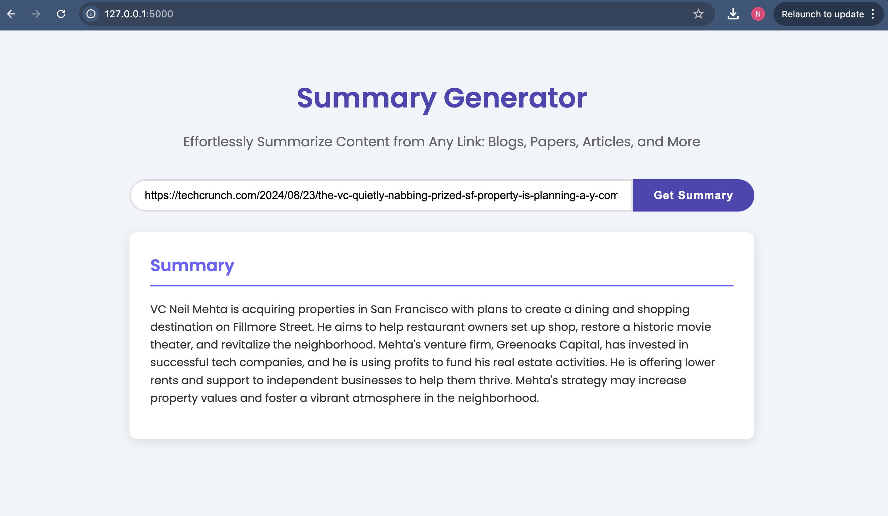

# URL Summariser

URL-Summariser is a web application that takes a URL as input and provides a concise summary of the content. It can handle various types of content, including blogs, articles, and research papers.



## Features

- Summarizes content from any URL.
- Supports HTML pages and PDF documents.
- Provides a quick and easy-to-use interface.

## Installation

To get started with URL-Summariser, follow these steps:

1. **Clone the Repository**

   ```bash
   git clone https://github.com/yourusername/URL-Summariser.git
   cd URL-Summariser

2. **Set Up a Virtual Environment (Optional but Recommended)**

   ```bash
   conda create -n env env_name
   conda activate env_name

3. **Install the Required Packages**

   ```bash
   pip install -r requirements.txt

## Usage
1. Save the updated Python code as app.py.
2. Save the updated HTML code in templates/index.html.
3. Run the application again: python app.py
4. Open a web browser and go to http://127.0.0.1:5000

## Project Structure
1. `app.py`: The main Python file containing the Flask application.
2. `templates/index.html`: The HTML template for the user interface.

## Example
1. Enter a URL into the search bar.
2. Click the "Summarize" button (or the equivalent action).
3. The application will display a summary of the content from the provided URL.


   
